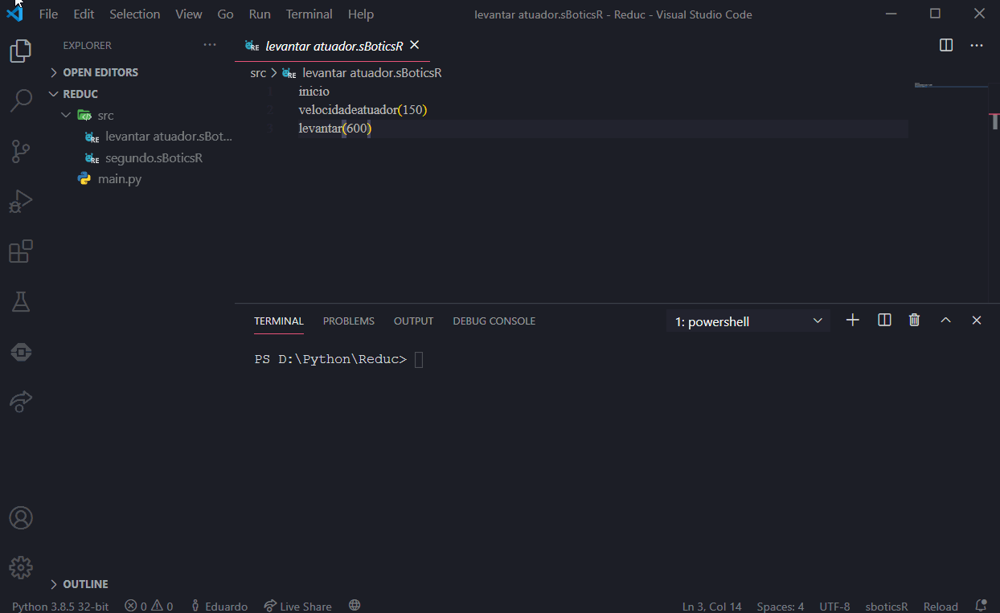

# R-EducCompiler
Um compilador de R-Educ para quem quer usar uma estrutura multifile (uma cópia do [sbotics compiler](https://github.com/GRFreire/sboticscompiler), porém pra R-Educ).
# Requerimentos
Para usar, você tem que ter o python instalado, pra isso basta fazer o download [aqui](https://www.python.org/ftp/python/3.8.6/python-3.8.6.exe) e seguir as instruções na tela de instalação.
# Uso
Você precisa ter uma estrutura de arquivos como essa abaixo, onde main.py é o que você baixa deste repositório.
```
📂src
 └ arquivo1.sBoticsR
 └ arquivo2.sBoticsR
 └ arquivo3.sBoticsR
main.py
```
Pra compilar pela primeira vez é só escrever `python main.py` no terminal/console, a partir daí, basta escrever `compilar` e pronto, ele faz as alterações no mesmo arquivo
O programa junta todos os arquivos em um só, por odem alfabética, o resultado final é algo como isso:
```
📂src
 └ arquivo1.sBoticsR
 └ arquivo2.sBoticsR
 └ arquivo3.sBoticsR
📂output
 └ main.sBoticsR
main.py
```
e é esse `main.sBoticsR` que você importa no simulador :)

Aqui embaixo tem uma demonstração:


OBS: O comando `inicio` deve ser colocado manualmente (por enquanto), seja no arquivo da `src` ou no `output`
